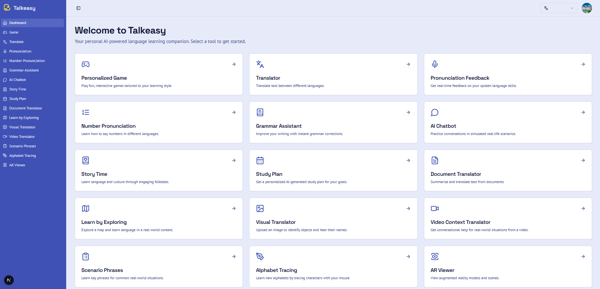

# Talkeasy AI Language Companion



Talkeasy is a modern, AI-powered web application designed to be your personal language learning partner. Built with Next.js, Genkit, and ShadCN UI, it offers a suite of interactive tools to help users practice and improve their skills in various languages.

## ✨ Features

Talkeasy provides a rich, multi-faceted learning experience through a variety of specialized tools:

-   **🎮 Personalized Learning Game:** An interactive, gamified journey with levels and tasks tailored to your learning style.
-   **🗣️ Pronunciation Feedback:** Get real-time AI analysis and scoring on your spoken pronunciation.
-   **🤖 AI Conversational Chatbot:** Practice your listening and speaking skills in realistic, AI-driven conversations.
-   **📚 Cultural Story Time:** Learn language and culture simultaneously through engaging, AI-generated folktales with audio narration.
-   **🗺️ Learn by Exploring:** A unique map-based feature where you can click on locations to get a real-world language mini-lesson.
-   **✍️ Grammar & Vocabulary Assistant:** Get instant feedback on your writing or speech to correct grammar and improve vocabulary.
-   **🔤 Alphabet Tracing:** Learn new alphabets by tracing characters and receiving AI feedback on your accuracy.
-   **📄 Document Translator:** Upload a PDF or paste text to receive a concise summary translated into your target language.
-   **...and many more!** Including a visual translator, scenario-based phrasebook, and a personalized study plan generator.

## 🛠️ Tech Stack

This project is built with a modern, powerful tech stack:

-   **Framework:** [Next.js](https://nextjs.org/) (App Router)
-   **AI/Generative:** [Google Genkit](https://firebase.google.com/docs/genkit)
-   **UI:** [React](https://react.dev/), [TypeScript](https://www.typescriptlang.org/)
-   **Styling:** [Tailwind CSS](https://tailwindcss.com/), [ShadCN UI](https://ui.shadcn.com/)
-   **Forms:** [React Hook Form](https://react-hook-form.com/) & [Zod](https://zod.dev/)

## 🚀 Getting Started

Follow these steps to get a local copy of the project up and running.

### Prerequisites

-   Node.js (v18 or later)
-   npm, pnpm, or yarn

### 1. Set Up Environment Variables

First, you'll need to provide your own API keys for the various Google services used in this application.

1.  Make a copy of the `.env.example` file and rename it to `.env`.
    ```bash
    cp .env.example .env
    ```
2.  Open the `.env` file and add your API keys. You can obtain these keys from the [Google Cloud Console](https://console.cloud.google.com/).

    ```env
    # For Google AI Studio / Gemini Models
    GEMINI_API_KEY="YOUR_GEMINI_API_KEY"

    # For Google Maps Platform (used in the "Explore" feature)
    NEXT_PUBLIC_GOOGLE_MAPS_API_KEY="YOUR_GOOGLE_MAPS_API_KEY"

    # For YouTube Data API (used in the "Study Plan" feature)
    YOUTUBE_API_KEY="YOUR_YOUTUBE_API_KEY"
    ```

### 2. Install Dependencies

Navigate to the project directory and install the necessary packages.

```bash
npm install
```

### 3. Run the Development Server

You can now start the development server.

```bash
npm run dev
```

# 🧍‍♀ 3D Model Details

project includes a female virtual assistant 3D model in .glb format.
Here are the details of the model included:


🎨 Model Description

Format: GLB (GLTF Binary)

Character Type: Female virtual assistant / avatar

Clothing: White shirt, dark grey pants

Style: Cartoon / semi-realistic

Rigged: Yes (body rig available)

Facial Features: Eyes, eyebrows, mouth, ready for animation

Rendering: Fully compatible with Three.js GLTFLoader

🧩 Model Usage in Project

Loaded in the frontend using GLTFLoader

Rendered with Three.js inside a WebGL canvas

Used for displaying responses during TTS/STT


---

## 📌 Step 1 — Run the Backend
Open a terminal and run:
```bash
cd backend
npm install
npm run dev
```
The backend server will start.

---

## 📌 Step 2 — Run the TTS Frontend
Open a **new terminal** and run:
```bash
cd tts/frontend
npm install
npm run dev
```
This starts the frontend (3D model + TTS/STT interface).

---

### ✔️ That’s it.
Your backend and frontend are now running together.

---

## 🧰 Technical Stack Used
Below is the complete list of technologies used in your project:

### **Backend**
- **Node.js** – JavaScript runtime
- **Express.js** – Backend server framework
- **REST API** – Communication between frontend and backend
- **npm** – Package manager

### **Frontend (TTS App + 3D Model)**
- **Vite / React or Plain JS** (depending on your setup)
- **Three.js** – Rendering the 3D avatar
- **GLTFLoader** – Loading the `.glb` model
- **HTML / CSS / JavaScript** – UI structure and styling

### **TTS (Text-to-Speech)**
Your project uses one of the following:
- **Web Speech Synthesis API** (browser-based TTS)
OR
- **OpenAI TTS API** (if configured in backend)
OR
- **Google gTTS** (if using Python in earlier versions)

### **STT (Speech-to-Text)**
Your project uses:
- **Web Speech Recognition API** (browser microphone → text)
OR
- **OpenAI Whisper API** (if configured)

### **Other Tools**
- **VS Code** – Recommended editor
- **Local Development Server** – Runs using `npm run dev`
- **Node Package Modules** – Installed per folder  
Your backend and frontend are now running together.


Open [http://localhost:9002](http://localhost:9002) with your browser to see the result. You can start editing the page by modifying `src/app/page.tsx`.

## 📜 License

This project is licensed under the MIT License. See the [LICENSE](LICENSE) file for details.
